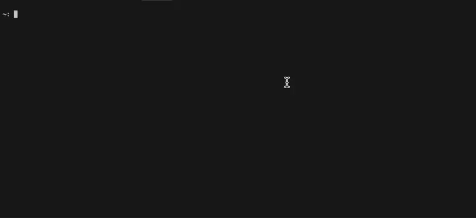

# 🚀 Gen: Simplify Your Code Templates
[](https://github.com/samuelgja/gen/actions/workflows/build.yml)
[](https://github.com/samuelgja/gen/actions/workflows/code-check.yml)

## 🌟 Introduction
Gen is your go-to tool for creating, managing, and using code templates across various programming languages and projects. Say goodbye to repetitive coding!




## 📦 Installation
```bash
curl -sSL https://raw.githubusercontent.com/samuelgja/gen/main/install.sh | sh
```

Or you can download the repo and build binary directly.

## 🤔 Why Gen?
- 📚 **Easy to Use**: Create and use your own template in matter of seconds.
- 🛠 **Efficient Template Management**: Tackle repetitive code across different projects with ease.
- 📁 **Versatile Templates**: From UI components to data models and boilerplate code.

## 🔧 How Gen Enhances IDE Templates
Unlike standard IDE templates that are limited to single files, Gen allows for a comprehensive template comprising multiple files.

## 📘 How Gen Works
1. **Template Directory**: The `.gen` folder in your project root contains templates and a config JSON file.
2. **Template Structure**: Templates consist of a path and content, both supporting variable inclusion.
3. **Types of Variables**: Use `__var__` for text inputs and `__select__` for dropdown selections.

### Key Components
- 📂 **Path**: Where to place the template.
- ✍️ **Content**: The template itself.
- 🖊️ **Variables**: Dynamic placeholders in the template.

## 📚 Gen Commands
- 🆕 `gen new`: Create a new template.
- 📝 `gen edit`: Edit an existing template.
- 🗑️ `gen delete`: Delete a template.
- 🔍 `gen fetch`: Fetch templates from GitHub or other URLs.
- ❓ `gen help`: Get help with commands.
- 🔄 `gen refresh`: Refresh all templates.
- 🎯 `gen use`: Use a specific template.
- 🔎 `gen variables`: List all template variables.
- 🔗 `--global` (`-g`): Use global scope.

## 🎯 Understanding Templates in Gen

### 🛠 Template Basics
In Gen, templates are key to automating code generation. They consist of:
- **Template Path**: Where your template files will reside in your project.
- **Template Content**: The actual code or structure within these files.

### 🧩 Template Variables
Template variables are dynamic elements in both your template path and content. There are two types:

1. **__var__**: A standard variable for text input.
   - Custom Naming: You can name it like `__var__myname__`.
   - Casing Support: You can specify the case format, such as `__var__kebab__`, `__var__camel__`, `__var__snake__`, or `__var__pascal__`.
   - Example: `const __var__pascal__ = __var__kebab__;`

2. **__select__**: A variable for predefined options.
   - Same rule as `__var__` for naming and casing and usage.
   - When creating a template, the CLI wizard prompts you to set options for these selects.
   - These options are stored in the template or config file `_.json`

### 🎲 Variable Usage Examples
- **In Paths**: `src/something/__select__/__var__.cpp`
- **In Content**: 
```typescript
  const __var__pascal__ = __var__kebab__;
```


## 📝 Example
Imagine a UI component template in `.gen/my-template`:
1. **UI Main Component**:
   - Path: `src/components/__var__/__var__.tsx`
   - Content: 
   ```tsx
        import React from 'react';
        import { __var__pascal__Props } from './__var__';
    
        const __var__pascal__: React.FC<__var__pascal__Props> = ({}) => {
        return <div></div>;
        };
    
        export default __var__pascal__;
    ```
2. **UI Component Test**:
   - Path: `src/components/__var__/__var__.test.tsx`
   - Content:  
   ```tsx
        import React from 'react';
        import { render } from '@testing-library/react';
        import __var__pascal__ from './__var__kebab__';
    
        describe('<__var__pascal__ />', () => {
            it('should render successfully', () => {
                const { baseElement } = render(<__var__pascal__ />);
                expect(baseElement).toBeTruthy();
            });
        });
    ```
3. **Index File Update**:
   - Path: `src/components/index.ts`
   - Content: 
   ```tsx
        export * from './__var__kebab/__var__kebab';
    ```

## 🔗 More Info
For detailed instructions and updates, visit: [Gen GitHub Page](https://github.com/samuelgja/gen)


### Roadmap
1. Currently `fetch` is in BETA, and it's plan to fetch any template from any URL for easy manage.
2. Store templates in cloud, and share with others.
3. Cleanup cli prints